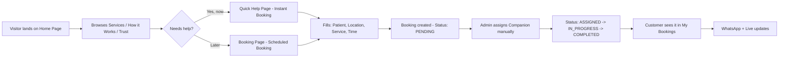
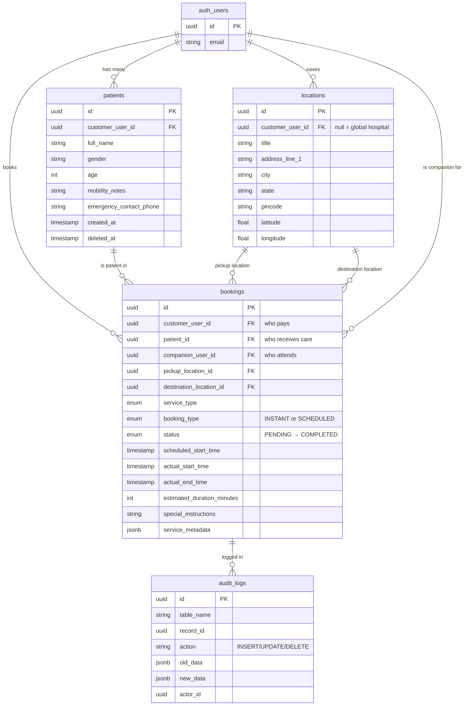

# 🎓 Junior Dev Intern Onboarding — Caresy Phone Project

> **For:** Interns who know very little technical things
> **Purpose:** Understand WHAT this project is, WHY it exists, HOW it works, WHERE the code lives, and WHAT went wrong before — so you can contribute without breaking things.
> **Time to read:** ~30 minutes | **Time to run locally:** ~10 minutes

---

## 📑 Table of Contents

1. [What is Caresy? (The Big Picture)](#1-what-is-caresy-the-big-picture)
2. [Why Are We Building This?](#2-why-are-we-building-this)
3. [How Does It Work? (User Journey)](#3-how-does-it-work-user-journey)
4. [Goal of the Project](#4-goal-of-the-project)
5. [Tech Stack — In Plain English](#5-tech-stack--in-plain-english)
6. [How to Run It on Your Laptop](#6-how-to-run-it-on-your-laptop)
7. [File Structure — Where Everything Lives](#7-file-structure--where-everything-lives)
8. [Database Structure — How Data is Stored](#8-database-structure--how-data-is-stored)
9. [What Went Wrong Before (Lessons)](#9-what-went-wrong-before-lessons)
10. [Types of Information in the App](#10-types-of-information-in-the-app)
11. [Your Role as Intern + First Tasks](#11-your-role-as-intern--first-tasks)
12. [Glossary (Words You Will Hear)](#12-glossary-words-you-will-hear)
13. [Rules to Not Break Things](#13-rules-to-not-break-things)
14. [Where to Get Help](#14-where-to-get-help)

---

## 1. What is Caresy? (The Big Picture)

**One sentence:** Caresy provides trusted **hospital companions** for families who cannot be physically present.

**Real example:** Your parents live in Noida. You work in Bangalore. Your father needs to go to Max Hospital for a checkup. You book a Caresy companion — a trained person who picks him up, stays with him at the hospital, handles queues, talks to the doctor, and brings him home safely. You get live updates on your phone.

**What this `caresy_phone` repo is:** The **customer-facing website** (the phone/web app). This is what the family sees and uses to book. It is NOT the admin dashboard or the companion app — it's the storefront.

```
Family opens website → Browses services → Books companion → Tracks booking → Gets help
```

---

## 2. Why Are We Building This?

### The Problem
- Many elderly people live alone or families are far away.
- Hospitals are confusing: long queues, paperwork, multiple counters.
- Families worry: "Who will stay with my parents at the hospital?"

### The Solution
A service layer between **family** and **hospital**. Caresy sends a human companion — not just a cab, but someone who **stays, waits, and cares**.

### Why a Website/App?
- Families need to book in **under 2 minutes** (often in an emergency).
- They need to **trust** us instantly (hence Trust & Safety page, testimonials).
- They need to work on **cheap phones + slow internet** (hence lightweight, fast pages).

> **If you understand this WHY, you will make better design/code decisions.**

---

## 3. How Does It Work? (User Journey)



**Two booking types to remember:**
- `INSTANT` — "I need someone NOW" (uses current time, no `scheduled_start_time`)
- `SCHEDULED` — "Come on Friday 10 AM" (has `scheduled_start_time`)

**Behind the scenes:** Right now, an **admin human** assigns companions manually. There is **no auto-dispatch algorithm yet** — that's intentional for the MVP.

---

## 4. Goal of the Project

### Current Goal (MVP — Noida / Greater Noida only)
1.  A **beautiful, fast, trustworthy** website that works on any phone.
2.  Bookings must **never get lost** — if someone pays, we must have the record.
3.  Works with **slow internet** and **light/dark phone settings** without breaking.

### Future Goal (Scaling)
- Cover all of Delhi NCR, then India.
- Auto-assign companions based on location + availability (like Uber).
- Add real-time companion tracking, payments, ratings.

> **Your goal as intern:** Keep the MVP **stable and clean**. Don't add big features until the small ones are solid.

---

## 5. Tech Stack — In Plain English

| Technology | What it is | Analogy |
|---|---|---|
| **Next.js 16** | Framework to build the website | The **house structure** — walls, rooms, routing |
| **React 19** | Library to build UI components | **LEGO bricks** — Header, Footer, Buttons |
| **TypeScript** | JavaScript with strict types | **Spell-check** for code — catches errors early |
| **Tailwind CSS 4** | Styling tool | **Paint + decoration** — colors, spacing, responsive |
| **Supabase** | Database + Auth (Postgres) | **Store room + security guard** — holds data, handles login |
| **Vercel** | Hosting | **Land** where the house is built — deploys the site |
| **Playwright** | Browser testing | **Robot tester** — clicks the site like a human to check it |

**Where code runs:**
- **Frontend:** Your browser (React renders pages)
- **Backend:** Supabase (stores bookings, patients, locations)
- **Auth:** Supabase Auth (email/phone login, handled in `AuthContext.tsx`)

---

## 6. How to Run It on Your Laptop

### Prerequisites (Ask a senior if stuck)
- Node.js v20+ installed
- Git installed
- VS Code installed

### Steps
```bash
# 1. Go to project folder
cd "caresy_phone"

# 2. Install dependencies (do this every time you pull new code)
npm install

# 3. Create env file (ask senior for .env.local content — NEVER commit it)
# It needs:
# NEXT_PUBLIC_SUPABASE_URL=...
# NEXT_PUBLIC_SUPABASE_ANON_KEY=...

# 4. Run locally
npm run dev

# 5. Open browser
http://localhost:3000
```

### Check it worked:
- Home page loads, header/footer visible
- Open `http://localhost:3000/booking` — should show booking form
- Open `http://localhost:3000/my-bookings` — should NOT be stuck on spinner (if it is, Supabase keys are missing)

### Before pushing ANY code:
```bash
npm run build
# If this shows RED errors, DO NOT push. Fix first.
```

---

## 7. File Structure — Where Everything Lives

> **Rule:** If you don't know where to look, start here.

```mermaid
graph TD
    ROOT[caresy_phone/] --> SRC[src/]
    ROOT --> PUBLIC[public/]
    ROOT --> SUPABASE[supabase/migrations]
    ROOT --> DOCS[docs/]
    ROOT --> PKG[package.json]

    SRC --> APP[src/app/]
    SRC --> COMP[src/components/]
    SRC --> CONTEXT[src/context/]
    SRC --> UTILS[src/utils/supabase/]
    SRC --> HOOKS[src/hooks/]
    SRC --> PROXY[src/proxy.ts]

    APP --> PAGES[Pages = Routes]
    PAGES --> HOME["page.tsx → / (Home)"]
    PAGES --> BOOKING["booking/page.tsx → /booking"]
    PAGES --> QUICK["quick-help/page.tsx → /quick-help"]
    PAGES --> MYB["my-bookings/page.tsx → /my-bookings"]
    PAGES --> SERVICES["services/page.tsx"]
    PAGES --> TRUST["trust/page.tsx"]
    PAGES --> ABOUT["about/page.tsx"]
    PAGES --> OTHER["faq, contact, privacy, terms, ..."]
    PAGES --> ADMIN["admin-ops/page.tsx (internal only)"]

    COMP --> HEADER["Header.tsx (top nav + mobile menu)"]
    COMP --> FOOTER["Footer.tsx"]
    COMP --> AUTH["AuthModal.tsx (login popup)"]
    COMP --> MOBILE["MobileBottomNav.tsx"]
    COMP --> WHATSAPP["WhatsAppWidget.tsx"]
    COMP --> COOKIE["CookieBanner.tsx"]

    UTILS --> CLIENT["client.ts (browser Supabase)"]
    UTILS --> SERVER["server.ts (server Supabase)"]
    UTILS --> MIDDLEWARE["middleware.ts (auth check)"]

    PUBLIC --> ASSETS["assets/*.png (photos) → convert to .webp soon"]
    SUPABASE --> MIGRATIONS["19_PUSH_NOTIFICATIONS.sql, 20_HOSPITALS.sql"]
    DOCS --> SCHEMA["08_Database/SUPABASE_SCHEMA.sql"]
```



### Folder Purposes (Detailed)

| Path | Purpose | When you touch it |
|---|---|---|
| `src/app/page.tsx` | Home page | Changing hero, stats, layout |
| `src/app/booking/page.tsx` | Booking form (scheduled) | Fixing form, colors, logic |
| `src/app/quick-help/page.tsx` | Instant booking | Urgent flow |
| `src/app/my-bookings/page.tsx` | List of user's bookings | Fetching from Supabase |
| `src/app/globals.css` | **ALL colors + theme** | **DANGER — one change affects whole site** |
| `src/components/Header.tsx` | Navigation + hamburger menu | Mobile menu bugs |
| `src/context/AuthContext.tsx` | Login state for whole app | Auth bugs |
| `src/utils/supabase/*` | Supabase connection | Never hardcode keys |
| `public/assets/` | Images | Optimize PNG → WebP |
| `supabase/migrations/` | Database changes | Only senior writes these |
| `docs/08_Database/` | Schema documentation | Read before DB work |

> **Image Tip:** Imagine `src/app/` as **rooms in a house**, `src/components/` as **furniture reused in many rooms**, and `supabase/` as the **underground storage**.

---

## 8. Database Structure — How Data is Stored

We use **Supabase (PostgreSQL)**. Think of it as Excel sheets with strict rules.



### Tables Explained Simply

**`patients`** — Not the login user, but the person who needs care. Example: You (customer) book for your father (patient). One customer can have many patients.

**`locations`** — Saved addresses. Two types:
- `customer_user_id = null` → Global place (e.g., "Max Hospital, Greater Noida") — everyone can see it.
- `customer_user_id = your id` → Your saved home address — only you see it.

**`bookings`** — The CORE table. Every row = one job. Links customer + patient + locations + companion + service. Status flows:
```
DRAFT → PENDING → ASSIGNED → IN_PROGRESS → COMPLETED
                          ↘ CANCELLED
```

**`audit_logs`** — A diary that writes itself. Every change to any table is logged: who did it, what changed, when. For debugging and compliance.

### Enums (Fixed Choices)

```sql
booking_status_enum: DRAFT, PENDING, ASSIGNED, IN_PROGRESS, COMPLETED, CANCELLED
booking_type_enum: INSTANT, SCHEDULED
service_type_enum: HOSPITAL_COMPANION, MEDICINE_PICKUP, DIAGNOSTIC_TEST,
                   QUEUE_MANAGEMENT, DOCUMENTATION, APPOINTMENT_ASSISTANCE, SAFE_RETURN
```

### Security (RLS — Row Level Security)
- You can **only see your own** patients/bookings/locations.
- Admins (`email LIKE '%@caresy.co'`) can see everything.
- Companions can see bookings assigned to them.
- This is enforced at the **database level**, not just in code — so even if frontend bugs, data stays safe.

---

## 9. What Went Wrong Before (Lessons)

Read this so you **don't repeat** these mistakes. Each had a real user impact.

### 🔴 1. Colors were inconsistent (4 pages looked like a different app)
**Where:** `booking/page.tsx`, `quick-help/page.tsx`, `my-bookings/page.tsx`, `AuthModal.tsx` used `slate-*` and `teal-*` (generic Tailwind) while rest of site used brand colors (`ink-teal`, `sage`, `paper`, `terracotta`).
**Impact:** Booking flow looked untrustworthy — like a template.
**Fix:** Edit `globals.css` `@theme` block to remap `slate-*` → brand colors globally. **Never hand-edit the 4 files.**
**Lesson:** Centralize design tokens. One `globals.css` change should fix many pages.

### 🔴 2. Dark mode broke the site
**Where:** Those same 4 files had `dark:` classes. If user's phone was in dark mode, those pages turned black while rest stayed cream.
**Impact:** 30-40% of users saw a broken theme.
**Fix:** In `globals.css`, change `@import "tailwindcss";` to:
```css
@import "tailwindcss";
@custom-variant dark (&:where(.force-dark, .force-dark *));
```
Now `dark:` only works if you add `force-dark` class — nothing has it, so site always stays light.
**Lesson:** Don't use `dark:` unless you design a full dark theme.

### 🟠 3. Fake-looking dynamic numbers
**Where:** `trust/page.tsx` and `quick-help/page.tsx` randomized "companions online" (5-12) and "callback minutes" (4-8) every 15 seconds. `booking/page.tsx` showed fixed 8/6.
**Impact:** User could open 3 tabs and see 3 different numbers — felt fake.
**Fix:** Delete the `useEffect` + `setInterval` block in `trust` and `quick-help`, keep `useState(8)` / `useState(6)` static. All 3 pages now show same stable numbers.
**Lesson:** Don't fake real-time data with `Math.random()`.

### 🟠 4. My Bookings stuck on spinner
**Where:** `my-bookings/page.tsx` showed infinite loader on live site, but code was correct.
**Root cause:** Missing env vars on Vercel: `NEXT_PUBLIC_SUPABASE_URL` and `NEXT_PUBLIC_SUPABASE_ANON_KEY`.
**Fix:** Add them in Vercel → Settings → Environment Variables → Redeploy. Check browser console (F12) for red errors.
**Lesson:** If a page is stuck loading, first check env vars, then console.

### 🟡 5. Mobile menu didn't open on phones
**Where:** `globals.css` had a leftover rule hiding the hamburger menu on ≤768px.
**Impact:** Mobile users couldn't navigate.
**Fix:** Already fixed, but always test menu on real phone or Chrome DevTools device mode.
**Lesson:** Always test on mobile width, not just desktop.

### 🟢 6. Images too large
**Where:** `public/assets/*.png` — PNGs are heavy.
**Impact:** Slow load on 4G, especially on low-end phones.
**Next:** Convert to `.webp` (same name, just extension), update `src="..."` paths.
**Lesson:** Optimize assets before shipping.

---

## 10. Types of Information in the App

| Type | Example | Where it lives | Who can see it |
|---|---|---|---|
| **Static Content** | Home hero, About us, How it works | `src/app/page.tsx`, `about/page.tsx` | Everyone |
| **Service Info** | Hospital Companion, Medicine Pickup, etc. | `src/app/services/page.tsx` + `service_type_enum` | Everyone |
| **User-Generated** | Booking form inputs, patient names | `bookings`, `patients` tables | Owner + Admin |
| **Location Data** | Hospital addresses, home pincode, lat/lng | `locations` table | Owner + Global |
| **Booking Lifecycle** | Status, timestamps, instructions | `bookings` table | Owner + Assigned Companion + Admin |
| **Trust Signals** | Testimonials, "8 companions online" | `trust/page.tsx`, `testimonials/page.tsx` | Everyone |
| **Legal** | Privacy, Terms, Cookie consent | `privacy/page.tsx`, `terms/page.tsx`, `CookieBanner.tsx` | Everyone |
| **Operational** | Admin-ops internal page | `admin-ops/page.tsx` | Admin only |
| **Sensitive** | Emergency phone, mobility notes | `patients.emergency_contact_phone` | Owner + Admin (RLS protected) |

> **Rule:** Never log or display `emergency_contact_phone` or full addresses in public pages.

---

## 11. Your Role as Intern + First Tasks

### What we expect from you
- **Week 1:** Read this doc, run the app, click every page on phone + desktop, note bugs.
- **Week 2:** Fix small UI bugs (like color/spacing), optimize one image to WebP.
- **Week 3+:** Build a small feature with senior guidance (e.g., improve My Bookings empty state).

### How to work
1.  **Never push directly to `main`** — create a branch: `fix/intern-yourname-shortdesc`.
2.  **One change = one commit** — e.g., "fix: booking page button color".
3.  **Always `npm run build` before PR** — if red, fix.
4.  **Take screenshots** before/after — attach to PR.
5.  **Ask early** — if stuck >30 mins, ping senior with what you tried.

### First 5 tasks (do in order)
- [ ] Task 1: Run locally, visit every route, list 5 observations (what's good / what's broken) in a doc.
- [ ] Task 2: Convert one image in `public/assets/` from PNG to WebP, update its `src` path, verify load speed.
- [ ] Task 3: Check `my-bookings` empty state — what does a new user see with 0 bookings? Propose better text.
- [ ] Task 4: Test header mobile menu at 360px width — does it open/close smoothly? Record a video.
- [ ] Task 5: Read `SUPABASE_SCHEMA.sql`, draw on paper the 4 tables and their links, show to senior.

---

## 12. Glossary (Words You Will Hear)

| Word | Means | Example |
|---|---|---|
| **Companion** | Trained person who stays with patient at hospital | Not a driver — a caretaker |
| **Patient** | Person receiving care (may not be the booker) | Father, mother, child |
| **Customer** | Person who pays and books (login user) | Son/daughter booking for parents |
| **Booking** | One job/transaction | "Booking #a1b2c3 for Max Hospital" |
| **RLS** | Row Level Security — DB rule: you only see your rows | Prevents seeing others' bookings |
| **MVP** | Minimum Viable Product — smallest useful version | Noida-only, manual assignment |
| **Vercel** | Platform that hosts the live site | Push to GitHub → auto-deploys to Vercel |
| **Supabase** | Backend (DB + Auth) | Like Firebase but uses Postgres |
| **Tailwind** | CSS framework | `bg-ink-teal`, `text-paper`, `p-4` are Tailwind classes |
| **MCP** | Model Context Protocol — lets AI use Supabase tools | For senior/dev-tools use |
| **Playwright** | Automated browser testing | `node scripts/browser.mjs` opens Chrome like a human |

---

## 13. Rules to Not Break Things

1.  **NEVER commit `.env.local`** — it has Supabase keys. It's in `.gitignore` for a reason.
2.  **NEVER edit `globals.css` theme without asking** — it affects every page.
3.  **NEVER delete `supabase/migrations/*.sql`** — they are history. Add new migration instead.
4.  **NEVER trust frontend alone for security** — always check RLS policies in Supabase.
5.  **NEVER use `Math.random()` for user-visible numbers** — it looks fake.
6.  **ALWAYS test on mobile width (360px - 768px)** — 70% of users are on phones.
7.  **ALWAYS run `npm run build` before PR** — catches TypeScript errors.

---

## 14. Where to Get Help

| Question | Where to look |
|---|---|
| "How does booking work?" | `docs/08_Database/BOOKING_ENGINE_SCHEMA.md` + `docs/04_Customer_App/CUSTOMER_HOME_SCREEN.md` |
| "What colors to use?" | `src/app/globals.css` → `@theme` block |
| "How to fix X?" | `DEVELOPER_FIX_LIST.md` (step-by-step, in order) |
| "Database schema?" | `docs/08_Database/SUPABASE_SCHEMA.sql` |
| "I'm stuck on code" | Ask senior with: what you tried, screenshot, error text (F12 console) |
| "I broke the build" | `npm run build` error message — copy-paste it to senior |

---

### 🎉 Welcome to Caresy!

You are joining a project that helps families care for their elders when they can't be there themselves. Every pixel you polish and every bug you fix directly reduces someone's worry.

**Start now:** Run `npm install` → `npm run dev` → open `http://localhost:3000` → click everything → write down what you see.

> This file lives at `JUNIOR_DEV_INTERN_ONBOARDING.md` — update it as you learn. The next intern will thank you.

---

*Last updated: 2026-08-16 | Maintained by: Engineering Team | Questions? Ask your onboarding buddy first.*
