# Customer Home Screen Design Specification

## Purpose
This document defines the production-ready frontend design and UX/UI specifications for the Caresy Customer Home Screen. The screen is designed to serve as the gateway for customers (often anxious family members booking care for elderly parents or themselves) to request companions and manage logistics. 

The architecture is **Mobile-First**, **Healthcare-Inspired**, **Minimal**, **Premium**, **Trust-Centered**, and fully compliant with **WCAG AA** accessibility standards using **Material 3** principles.

---

## 1. Design Philosophy & Theme
To foster trust and calmness, the visual theme combines clinical professionalism with warm, human care:
* **Deep Ink Teal (`#16302B`)**: Used for structure, text contrast, and headers. Conveys authority, safety, and professional excellence.
* **Warm Paper Off-White (`#F5F4EE`)**: The primary screen background. Avoids the cold, clinical feel of stark white, creating a welcoming and premium atmosphere.
* **Marigold (`#E7A33E` to `#C7842A`)**: The primary warm accent, used for planned buttons, badges, and trust highlights.
* **Vermilion (`#D85C46` to `#B84630`)**: Reserved strictly for high-urgency and emergency call-to-actions.
* **Sage Green (`#DCE6D9`)**: Soft background for positive notifications, verified companion badges, and safety status.

---

## 2. Wireframe & Visual Layout
Designed as a single-column, bottom-navigation-anchored viewport (typically running inside a hybrid app container or mobile browser).

```mermaid
graph TD
    subgraph Viewport [Mobile Screen Viewport - 360x740]
        direction TB
        
        %% 1. APP BAR
        subgraph AppBar [1. App Bar - Sticky Top]
            Avatar[Profile / Greeting]
            Title[Caresy Logo]
            SOSBtn[SOS Button - Vermilion]
        end

        %% 2. ACTIVE BOOKING
        subgraph ActiveBooking [2. Active Booking Banner - Dynamic]
            ActiveCard["💬 Attendant En Route: Anil Kumar
                        📍 Destination: Max Hospital (Greater Noida)
                        [Call Companion] [Track Live]"]
        end

        %% 3. PRIMARY CALL TO ACTIONS
        subgraph IntentGrid [3. Intent Selector - Hero Grid]
            UrgentCard["🚨 Emergency Now
                       (Companion in 15-30m)"]
            PlannedCard["📅 Schedule Visit
                        (Book future appointments)"]
        end

        %% 4. QUICK SERVICES
        subgraph ServicesSection [4. Services List]
            Service1[Hospital Companion]
            Service2[Medicine Pickup]
            Service3[Diagnostic Test]
            Service4[Safe Return]
        end

        %% 5. COMPANION CAROUSEL
        subgraph CompanionsCarousel [5. Verified Companions - Horizontal Scroll]
            Comp1["Sarah (★ 4.9)
                   Hindi, English"]
            Comp2["Anil (★ 4.8)
                   Hindi, Punjabi"]
        end

        %% 6. TRUST SECTOR
        subgraph TrustSector [6. Trust & Safety Indicators]
            Badge1[100% KYC Verified]
            Badge2[50+ Partner Hospitals]
        end

        %% 7. BOTTOM NAV
        subgraph BottomNav [7. Bottom Nav Bar - Sticky Bottom]
            NavHome["🏠 Home (Active)"]
            NavBookings["📋 Bookings"]
            NavSupport["📞 Support"]
            NavProfile["👤 Profile"]
        end
    end

    AppBar --> ActiveBooking
    ActiveBooking --> IntentGrid
    IntentGrid --> ServicesSection
    ServicesSection --> CompanionsCarousel
    CompanionsCarousel --> TrustSector
    TrustSector --> BottomNav
```



---

## 3. Component Hierarchy & Specifications

### A. Sticky App Bar (Header)
* **Purpose**: Identity and emergency breakout.
* **Elements**:
  * **Avatar/Greeting**: Small circular profile picture (40x40px). Text: `Hello, Meera` (14px, Medium, Charcoal). Underneath: `Noida` with a small location pointer icon.
  * **Brand Name**: Center aligned `Caresy` (18px, Bold, Ink Teal).
  * **SOS / Help Button**: Red icon button on the right (44x44px target) with a phone receiver icon. Launches direct 24/7 hotline overlay.
* **A11y**: App Bar uses HTML5 `<header>` tag. Profile photo must have `alt="Rohan's Profile"`.

### B. Dynamic Active Booking Banner
* **Purpose**: Reassures users during an active care shift by displaying real-time status.
* **Logic**: Only render when `bookings.status` is `ASSIGNED` or `IN_PROGRESS`.
* **Visuals**:
  * Floating glassmorphic card (90% width, 12px margin).
  * Green pulsing dot indicator (`.pulse` animation) to represent live activity.
  * Companion thumbnail photo (48x48px, rounded circular).
  * Details: Companion name, current status (e.g. *"Checked in at Fortis Hospital Noida"*), and a dynamic timer/progress bar showing elapsed time.
  * Action Buttons: `[Call Companion]` (Secondary button) and `[Live Chat]` (Link).
* **A11y**: Card has `role="status"` and `aria-live="polite"` so state updates are announced immediately.

### C. Hero Intent Selector (Primary Grid)
* **Purpose**: Clear entry path depending on patient status.
* **Layout**: 2-column flex/grid with high vertical cards (height ~140px).
* **Card 1: "Emergency Now" (Instant Booking)**
  * **Background**: Linear gradient from Vermilion (`#D85C46`) to Deep Vermilion (`#B84630`).
  * **Text**: White text. Headline: `Emergency Now` (18px, Bold). Body: `Attendant reaches in 20-30 mins` (12px, Regular).
  * **Icon**: Lightning bolt / alert icon.
* **Card 2: "Schedule Visit" (Planned Booking)**
  * **Background**: Linear gradient from Marigold (`#E7A33E`) to Deep Marigold (`#C7842A`).
  * **Text**: Deep Ink Teal (`#16302B`) text for high contrast. Headline: `Schedule Visit` (18px, Bold). Body: `Book for doctor appointment or diagnostic` (12px, Regular).
  * **Icon**: Calendar icon.
* **A11y**: Tap targets occupy the entire card area (min size 140x140px). Text colors satisfy WCAG contrast (White on Vermilion is 4.1:1, add deep border or shadow to elevate to >4.5:1. Ink Teal on Marigold is 6.2:1, passing AA comfortably).

### D. Services Section
* **Purpose**: Specific service forms for quick access.
* **Layout**: Horizontal icon chip list or a clean 2x2 grid.
* **Services**:
  1. **Hospital Companion** (Icon: `Activity` / Health line)
  2. **Medicine Pickup** (Icon: `Pill` / Capsule)
  3. **Diagnostic Test** (Icon: `Flask` / Test tube)
  4. **Safe Return Home** (Icon: `Home` / House check)
* **Visuals**: Light paper/sage cards, clean borders (`1px solid rgba(22, 48, 43, 0.12)`), dark teal text.

### E. Verified Companions Carousel
* **Purpose**: Establishes emotional safety. Anxious children booking for parents need to see *who* will be accompanying them.
* **Layout**: Horizontal overflow scroll container (`display: flex; overflow-x: auto; scroll-snap-type: x mandatory;`).
* **Companion Card**:
  * Thumbnail photo (56x56px, high resolution, smiling, warm lighting).
  * Companion name + rating badge (e.g. `★ 4.9 (42 reviews)`).
  * Tag list: `Specialty: Elderly Care`, `Languages: Hindi, English`.
  * Dynamic Badge: `● Active Now in Greater Noida`.
* **A11y**: Slide items use `scroll-snap-align: center`. Screen readers can navigate slides sequentially.

### F. Trust & Safety Badges
* **Purpose**: Address friction points around verification, cost, and reliability.
* **Badges**:
  * 🛡️ **100% Police Verified**: Background check complete.
  * 🏥 **50+ Noida & Greater Noida Partner Hospitals**: Establishes local presence.
  * 📞 **24/7 Ops Control Room**: Customer support availability.

### G. Sticky Bottom Navigation Bar
* **Purpose**: Standard app dashboard layout.
* **Items**:
  * **Home** (Icon: `home`, Active state with deep ink teal fill and warm marigold bottom dot marker).
  * **My Bookings** (Icon: `calendar`, Shows dot badge if there's an active booking).
  * **Help/Support** (Icon: `phone-call`, Opens quick support).
  * **Profile** (Icon: `user`, Access settings/saved patients).
* **A11y**: Uses `<nav>` semantic wrapper. Active tab has `aria-current="page"`.

---

## 4. Spacing & Typography (Material 3 Scale)

### Spacing System (8px Grid)
* **Screen Margin**: `16px` on mobile, `24px` on desktop.
* **Section Gap**: `24px` or `32px` between major blocks.
* **Component Padding**: `12px` (small chips/badges), `16px` (service cards), `20px` (hero intent cards).
* **Grid Gaps**: `12px` to `16px` for grid items.

### Typography (Poppins / System Sans)
* **Display Bold** (Hero headers): `2.2rem` (`35px`), line-height: `1.2`
* **Headline Bold** (Sections): `1.4rem` (`22px`), line-height: `1.3`
* **Title Medium** (Cards): `1rem` (`16px`), line-height: `1.4`
* **Body Regular** (Descriptions): `0.88rem` (`14px`), line-height: `1.5`, Color: `--muted-teal-gray`
* **Label Bold** (Badges/Buttons): `0.75rem` (`12px`), uppercase, letter-spacing: `0.05em`

---

## 5. Micro-Animations & Interactions

1. **Card Hover/Tap States**:
   * Desktop hover / Mobile touch start: `transform: translateY(-4px) scale(1.02);` and card shadow elevates from `shadow-1` to `shadow-2` with a `cubic-bezier(0.16, 1, 0.3, 1)` transition (duration `250ms`).
2. **Pulsing Active Indicator**:
   * Pulsing dot next to active bookings:
     ```css
     @keyframes pulse {
       0% { box-shadow: 0 0 0 0 rgba(39, 168, 117, 0.5); }
       70% { box-shadow: 0 0 0 8px rgba(39, 168, 117, 0); }
       100% { box-shadow: 0 0 0 0 rgba(39, 168, 117, 0); }
     }
     ```
3. **Carousel Physics**:
   * Smooth horizontal scrolling with inertia (`-webkit-overflow-scrolling: touch;`).

---

## 6. Accessibility & WCAG AA Checklist
- [x] **Contrast Ratios**: All text elements have a minimum contrast of 4.5:1 against their background.
  * Ink Teal text (`#16302B`) on Warm Paper background (`#F5F4EE`) = **11.2:1** (Passes AAA)
  * Deep Teal text (`#16302B`) on Marigold background (`#E7A33E`) = **6.2:1** (Passes AA)
  * *Notice*: Do not use white text on Marigold. Always use `#16302B` (Ink Teal) or `#232B28` (Charcoal) for text inside Marigold components.
- [x] **Touch Targets**: All interactive elements (buttons, navigation tabs, companion cards) are at least `48x48px` with clear padding.
- [x] **Focus Ring**: Keyboard users receive a clear visual focus outline (`2px solid var(--marigold)`) with an offset when tab-navigating.
- [x] **Screen Reader Support**:
  * Descriptive `alt` tags on all photos (e.g. `alt="Photo of companion Anil Kumar"`).
  * SVGs marked with `aria-hidden="true"` if decorative, or provided with `<title>` tags.
  * Dynamic status areas wrapped with `aria-live="polite"`.

---

## 7. Responsive Design (Desktop Adaptation)
While Caresy is mobile-first, the desktop web wrapper expands gracefully:
* **Max Width Wrapper**: The layout is restricted to a clean phone-frame centered container on desktop (`max-width: 480px; margin: 0 auto; min-height: 100vh; background: var(--surface); box-shadow: var(--shadow-2);`) OR a split-screen layout.
* **Split-Screen Layout (Desktop Alternate)**:
  * **Left Side**: Beautiful marketing hero content, local map, phone graphic, app download call-to-actions.
  * **Right Side**: The live phone app container rendering the home screen, allowing customers to easily simulate/use the service.
