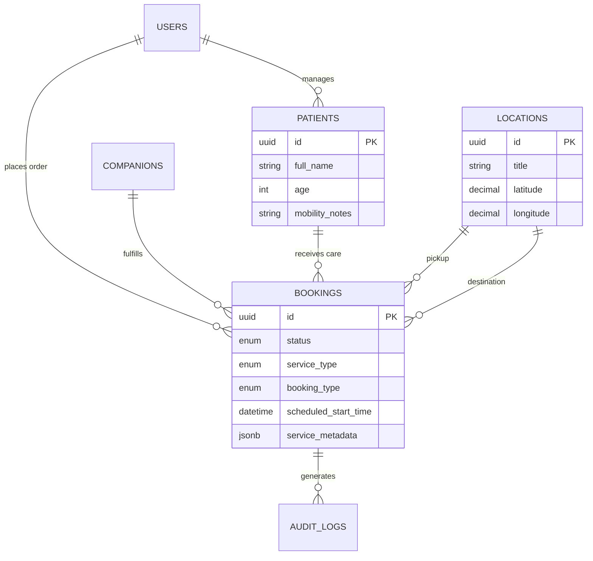

# Caresy Booking Engine Schema

## Purpose
This document defines the production-ready PostgreSQL database schema for the Caresy Booking Engine. The architecture is designed to support the MVP (Noida/Greater Noida) manual assignment flow while providing strict normalization, indexing, and auditing to support future automated dispatch and nationwide scaling.

## 1. Enums & Custom Types
Using Enums for strict type safety and faster indexing at the database level.

```sql
-- Represents the current state of a booking lifecycle
CREATE TYPE booking_status_enum AS ENUM (
    'DRAFT',           -- User is filling out the form
    'PENDING',         -- Submitted, awaiting manual admin assignment
    'ASSIGNED',        -- Companion assigned, en route or scheduled
    'IN_PROGRESS',     -- Companion has checked in / started the job
    'COMPLETED',       -- Job finished successfully
    'CANCELLED'        -- Cancelled by customer or admin
);

-- Differentiates urgent vs planned logistics
CREATE TYPE booking_type_enum AS ENUM (
    'INSTANT', 
    'SCHEDULED'
);

-- Core services offered by Caresy
CREATE TYPE service_type_enum AS ENUM (
    'HOSPITAL_COMPANION',
    'MEDICINE_PICKUP',
    'DIAGNOSTIC_TEST',
    'QUEUE_MANAGEMENT',
    'DOCUMENTATION',
    'APPOINTMENT_ASSISTANCE',
    'SAFE_RETURN'
);
```

## 2. Core Tables

### A. patients
Customers book for themselves or family members (e.g., elderly parents). This table separates the physical patient from the paying customer account.

```sql
CREATE TABLE patients (
    id UUID PRIMARY KEY DEFAULT gen_random_uuid(),
    customer_user_id UUID NOT NULL, -- FK to Users table (Authentication Engine)
    full_name TEXT NOT NULL,
    gender TEXT, -- TODO: Define strict enum if required by Product
    age INTEGER CHECK (age > 0 AND age < 130),
    mobility_notes TEXT, -- e.g., "Uses wheelchair"
    emergency_contact_phone VARCHAR(15), 
    
    -- System Fields
    created_at TIMESTAMPTZ NOT NULL DEFAULT NOW(),
    updated_at TIMESTAMPTZ NOT NULL DEFAULT NOW(),
    deleted_at TIMESTAMPTZ -- Soft Delete
);
```

### B. locations
Standardized address table for hospitals, labs, and home addresses to enable future spatial querying and routing.

```sql
CREATE TABLE locations (
    id UUID PRIMARY KEY DEFAULT gen_random_uuid(),
    customer_user_id UUID, -- Nullable if it's a global hospital, populated if saved home address
    title TEXT NOT NULL, -- e.g., "Max Hospital, Greater Noida", "Home"
    address_line_1 TEXT NOT NULL,
    address_line_2 TEXT,
    city TEXT NOT NULL DEFAULT 'Noida',
    state TEXT NOT NULL DEFAULT 'Uttar Pradesh',
    pincode VARCHAR(10) NOT NULL,
    latitude NUMERIC(10, 7), -- TODO: Migrate to PostGIS geography type when spatial routing is needed
    longitude NUMERIC(10, 7),
    
    -- System Fields
    created_at TIMESTAMPTZ NOT NULL DEFAULT NOW(),
    updated_at TIMESTAMPTZ NOT NULL DEFAULT NOW(),
    deleted_at TIMESTAMPTZ
);
```

### C. bookings
The central transaction table. Designed to be flat for fast reads, relying on JSONB for flexible context until schemas formalize.

```sql
CREATE TABLE bookings (
    id UUID PRIMARY KEY DEFAULT gen_random_uuid(),
    
    -- Relationships
    customer_user_id UUID NOT NULL,        -- Who pays/booked
    patient_id UUID NOT NULL REFERENCES patients(id), -- Who receives care
    companion_user_id UUID,                -- Nullable for MVP manual assignment state
    pickup_location_id UUID NOT NULL REFERENCES locations(id),
    destination_location_id UUID REFERENCES locations(id), -- Nullable for services like 'Safe Return'
    
    -- Core Logistics
    service_type service_type_enum NOT NULL,
    booking_type booking_type_enum NOT NULL,
    status booking_status_enum NOT NULL DEFAULT 'PENDING',
    
    -- Timestamps
    scheduled_start_time TIMESTAMPTZ,      -- Null if INSTANT
    actual_start_time TIMESTAMPTZ,
    actual_end_time TIMESTAMPTZ,
    
    -- Pricing & Context
    estimated_duration_minutes INTEGER,
    special_instructions TEXT,
    service_metadata JSONB, -- TODO: Use for flexible service-specific data (e.g., Doctor name, test type) before normalizing
    
    -- System Fields
    created_at TIMESTAMPTZ NOT NULL DEFAULT NOW(),
    updated_at TIMESTAMPTZ NOT NULL DEFAULT NOW(),
    deleted_at TIMESTAMPTZ,

    -- Constraints
    CONSTRAINT chk_end_after_start CHECK (actual_end_time >= actual_start_time)
);
```

### D. audit_logs
Immutable ledger for all critical state changes (Compliance & Debugging).

```sql
CREATE TABLE audit_logs (
    id UUID PRIMARY KEY DEFAULT gen_random_uuid(),
    table_name TEXT NOT NULL,
    record_id UUID NOT NULL,
    action TEXT NOT NULL CHECK (action IN ('INSERT', 'UPDATE', 'DELETE')),
    old_data JSONB,
    new_data JSONB,
    actor_id UUID, -- Who made the change (Admin ID, Customer ID, or System)
    created_at TIMESTAMPTZ NOT NULL DEFAULT NOW()
);
```

## 3. Indexes
Optimized for typical query patterns: Dashboard fetching, companion availability, and customer history.

```sql
-- Patients
CREATE INDEX idx_patients_customer_user_id ON patients(customer_user_id) WHERE deleted_at IS NULL;

-- Locations
CREATE INDEX idx_locations_city ON locations(city);
CREATE INDEX idx_locations_lat_lng ON locations(latitude, longitude);

-- Bookings (Highly queried)
CREATE INDEX idx_bookings_customer_id ON bookings(customer_user_id) WHERE deleted_at IS NULL;
CREATE INDEX idx_bookings_companion_id ON bookings(companion_user_id) WHERE deleted_at IS NULL;
CREATE INDEX idx_bookings_status ON bookings(status);
CREATE INDEX idx_bookings_scheduled_time ON bookings(scheduled_start_time) WHERE status IN ('PENDING', 'ASSIGNED');

-- Audit Logs (Partitioning candidate for future)
CREATE INDEX idx_audit_logs_record_id ON audit_logs(record_id);
```

## 4. Database Triggers & Functions

### A. Auto-Update Timestamp
```sql
CREATE OR REPLACE FUNCTION trigger_set_timestamp()
RETURNS TRIGGER AS $$
BEGIN
  NEW.updated_at = NOW();
  RETURN NEW;
END;
$$ LANGUAGE plpgsql;

CREATE TRIGGER set_timestamp_bookings
BEFORE UPDATE ON bookings
FOR EACH ROW EXECUTE PROCEDURE trigger_set_timestamp();

CREATE TRIGGER set_timestamp_patients
BEFORE UPDATE ON patients
FOR EACH ROW EXECUTE PROCEDURE trigger_set_timestamp();
```

### B. Audit Logging Trigger
Automatically captures UPDATE and DELETE operations on the bookings table.

```sql
CREATE OR REPLACE FUNCTION trigger_audit_bookings()
RETURNS TRIGGER AS $$
BEGIN
    IF (TG_OP = 'UPDATE') THEN
        INSERT INTO audit_logs (table_name, record_id, action, old_data, new_data, actor_id)
        VALUES ('bookings', OLD.id, 'UPDATE', row_to_json(OLD)::jsonb, row_to_json(NEW)::jsonb, NEW.updated_by);
        RETURN NEW;
    ELSIF (TG_OP = 'DELETE') THEN
        INSERT INTO audit_logs (table_name, record_id, action, old_data, actor_id)
        VALUES ('bookings', OLD.id, 'DELETE', row_to_json(OLD)::jsonb, current_setting('request.jwt.claim.sub', true)::uuid);
        RETURN OLD;
    END IF;
    RETURN NULL;
END;
$$ LANGUAGE plpgsql;

CREATE TRIGGER audit_bookings_changes
AFTER UPDATE OR DELETE ON bookings
FOR EACH ROW EXECUTE PROCEDURE trigger_audit_bookings();
```

## 5. Entity Relationship Diagram (ERD)



## 6. Migration Notes & Deployment Strategy
* **Idempotency**: All schema files must be idempotent. Use `CREATE TABLE IF NOT EXISTS` and `DO $$ BEGIN ... EXCEPTION WHEN duplicate_object THEN null; END $$;` for ENUMs in actual migration tools (e.g., Flyway, Prisma, Liquibase).
* **Soft Deletes**: Application logic (ORMs) must globally append `WHERE deleted_at IS NULL` on all read queries.
* **No Hard Deletes**: DELETE queries are forbidden at the application level; use `UPDATE table SET deleted_at = NOW()`.
* **Timezones**: All `TIMESTAMPTZ` fields are stored in UTC. Client applications must convert to `Asia/Kolkata` (IST) on the frontend.

## 7. TODOs (Pending Product Clarifications)
* **Pricing Engine Tie-in**: Define how `total_amount` and `payment_status` interact with the bookings table. Should pricing be a separate invoices table mapped 1:1 with bookings?
* **Geospatial Tooling**: Confirm if we should initialize the PostGIS extension now for locations or rely on numerical lat/long for MVP.
* **Companion Schema**: `companion_user_id` is treated as a UUID reference to a generic Users/Auth table. Confirm if Companions will have a dedicated physical table for KYC data and active shift tracking.
* **Auth Context in Triggers**: The Audit trigger currently assumes standard Postgres user execution. Depending on the backend (e.g., Node.js), we need to inject the `actor_id` (current logged-in user) into the session variables before firing the update.
